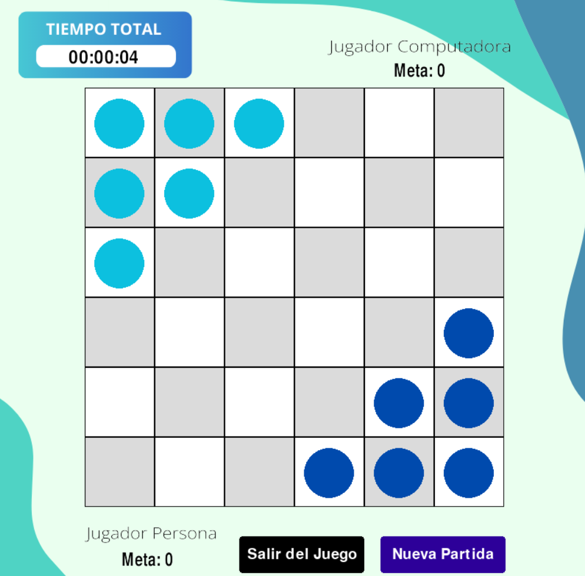

# Intelligent Chinese Checkers Game
Welcome to the Intelligent Chinese Checkers Game repository! This project is a computerized version of the classic Chinese Checkers game, where you can compete against an intelligent computer opponent. The game is developed in the Jupyter Notebook environment using Python.

  

## Features
- Intelligent Computer Opponent: Challenge yourself against a computer opponent that uses advanced algorithms to make strategic moves.
- User-Friendly Menu: Easily navigate through the game with a user-friendly menu system.
- Move Chips: Make your moves by selecting and moving the corresponding chips on the board.
- Result Display: After the game, a result image will be displayed, showcasing whether you won or lost.

## Requirements
- pygame
- sys
- time
- os
- math
- random
- numpy
- copy
